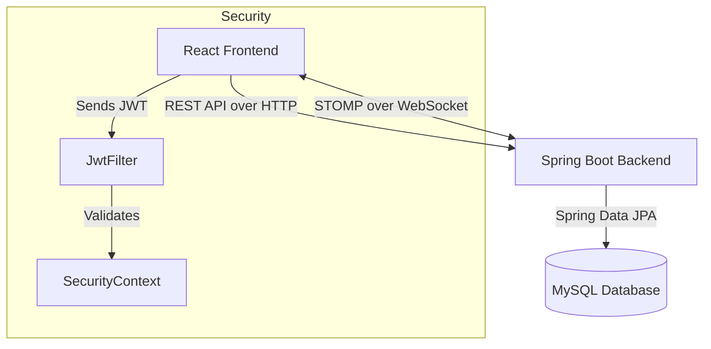

# GeoAttend - Real-Time Geofencing Attendance System

A robust, role-based attendance management system that uses **GPS geofencing** to ensure students are physically present in class. Built with **Spring Boot (Java)** on the backend and **React (Vite)** on the frontend, featuring real-time WebSocket updates, JWT security, and interactive dashboards.

## 🔗 Live Demo (Local)
- **Frontend**: [http://localhost:5173](http://localhost:5173)
- **Backend API**: [http://localhost:8088](http://localhost:8088)

---

## 📖 Table of Contents
- [How It Works](#-how-it-works)
- [Architecture Overview](#-architecture-overview)
- [Tech Stack](#-tech-stack--why)
- [Key Features](#-key-features)
- [Real-Time Implementation](#-real-time-implementation)
- [Database Schema](#-database-design)
- [API Endpoints](#-api-endpoints)
- [Setup & Run](#-how-to-run)
- [Folder Structure](#-folder-structure)

---

## 🎯 How It Works
1. **Teacher Starts Session**: Teacher sets a geofence (e.g., 100m radius) around their current location.
2. **Student Joins**: Student logs in and clicks "Mark Attendance" on their dashboard.
3. **Geofencing Check**: The backend calculates the distance between the student and teacher using the **Haversine Formula**.
4. **Verification**: 
   - If distance < radius: Attendance is marked **PRESENT** ✅.
   - If distance > radius: Request rejected with distance error ❌.
5. **Real-Time Update**: The teacher's dashboard updates instantly via **WebSockets** to show the new count.

---

## 🏗 Architecture Overview



---

## 🛠 Tech Stack & Why

| Layer | Technology | Why I Chose It |
|-------|------------|----------------|
| **Frontend** | React 18 + Vite | Blazing fast build tool, component-based logic for dashboards. |
| **Backend** | Spring Boot 3.2 | Production-ready Java framework with built-in DI, Security, and WebSocket support. |
| **Database** | MySQL | Reliable relational database for structured user/attendance data. |
| **Real-time** | WebSocket (STOMP) | Efficient bi-directional communication for live attendance counters. |
| **Security** | Spring Security + JWT | Stateless, secure authentication suitable for modern SPA architectures. |
| **Styling** | Modern CSS | Custom Glassmorphism design system for a premium feel (no Tailwind/Bootstrap dependency). |

---

## ✨ Key Features
- **Role-Based Access Control (RBAC)**: Distinct portals for Admin, Teacher, and Student.
- **Geofencing Logic**: Server-side validation of GPS coordinates prevents spoofing.
- **Smart Attendance**: Auto-marks "ABSENT" if a student fails to mark attendance when session ends.
- **Re-marking Support**: Allows "ABSENT" students to mark "PRESENT" if the teacher re-opens the session.
- **Interactive Dashboards**:
  - **Admin**: User management tables, extensive analytics pie charts.
  - **Teacher**: Live session controls, real-time counter, radius adjustment.
  - **Student**: Subject-wise attendance stats, active session finder, history logs.

---

## ⚡ Real-Time Implementation

### Why STOMP?
Instead of raw WebSockets, I used **STOMP** (Simple Text Oriented Messaging Protocol) for its pub/sub model. This allows the teacher to subscribe to a specific topic (e.g., `/topic/attendance/{teacherId}`) and receive updates only for their class.

### Message Flow
1. **Student** marks attendance via POST `/api/student/mark-attendance`.
2. **Backend** validates geofence and saves record.
3. **Backend** publishes event via `SimpMessagingTemplate` to `/topic/attendance/{teacherId}`.
4. **Teacher's Frontend** receives the payload and increments the live counter instantly.

---

## 🗄 Database Design

### E-R Diagram Logic
- **Users**: Unified table for all roles (`ADMIN`, `TEACHER`, `STUDENT`) with discriminators.
- **TeacherDetails**: One-to-One with Users; stores current session config (lat/lon, radius).
- **Attendance**: Many-to-One with Users (Student & Teacher); stores time, status, and location.

```sql
CREATE TABLE users (
    id BIGINT AUTO_INCREMENT PRIMARY KEY,
    name VARCHAR(255),
    email VARCHAR(255) UNIQUE,
    password VARCHAR(255),
    role VARCHAR(50) -- 'ADMIN', 'TEACHER', 'STUDENT'
);

CREATE TABLE teacher_details (
    id BIGINT AUTO_INCREMENT PRIMARY KEY,
    teacher_id BIGINT,
    latitude DOUBLE,
    longitude DOUBLE,
    radius DOUBLE,
    is_active BOOLEAN,
    subject VARCHAR(255)
);

CREATE TABLE attendance (
    id BIGINT AUTO_INCREMENT PRIMARY KEY,
    student_id BIGINT,
    teacher_id BIGINT,
    date DATE,
    status VARCHAR(50), -- 'PRESENT', 'ABSENT'
    timestamp DATETIME
);
```

---

## 🔌 API Endpoints

### Auth
- `POST /api/auth/login` - Authenticate & get JWT
- `POST /api/auth/register` - Student self-registration

### Teacher
- `POST /api/teacher/start-session` - Start geofence session
- `POST /api/teacher/stop-session` - Stop session (auto-marks absentees)
- `GET /api/teacher/attendance/today/{id}` - Get live records

### Student
- `POST /api/student/mark-attendance` - Attempt to mark attendance
- `GET /api/student/stats/{id}` - Get attendance percentage/stats

---

## 🚀 How to Run

### Prerequisites
- Java 17+
- Node.js 16+
- MySQL Server

### 1. Database Setup
Create a database named `geofencing_attendance` in MySQL.
```sql
CREATE DATABASE geofencing_attendance;
```
*Note: Tables are auto-generated by Hibernate on basic start.*

### 2. Backend Setup
1. Navigate to `backend/src/main/resources/application.properties`.
2. Update your MySQL username/password.
3. Run the Spring Boot application.
4. **Demo credentials** seeded on startup:
   - Admin: `admin@geofence.com` / `admin123`
   - Teacher: `teacher@geofence.com` / `teacher123`
   - Student: `student@geofence.com` / `student123`

### 3. Frontend Setup
```bash
cd frontend
npm install
npm run dev
```
Access the app at `http://localhost:5173`.

---

## 📂 Folder Structure

```
Geofencing/
├── backend/
│   ├── src/main/java/com/geofencing/attendance/
│   │   ├── config/          # WebSocket & Security Config
│   │   ├── controller/      # REST API Controllers
│   │   ├── entity/          # JPA Models
│   │   ├── repository/      # DB Interfaces
│   │   ├── service/         # Business Logic (Geofencing via Haversine)
│   │   └── security/        # JWT Filters & Utils
│   └── src/main/resources/  # Properties file
│
└── frontend/
    ├── src/
    │   ├── components/      # React functional components
    │   ├── utils/           # API & Location helpers
    │   ├── App.jsx          # Routing & Auth protection
    │   └── index.css        # Global Glassmorphism styles
    └── package.json         # Dependencies
```

---

## ⚖️ Trade-offs & Decisions
1. **Haversine vs. Database Geo-spatial**: I used Java-side Haversine formula for simplicity and database agnosticism. For millions of users, I'd switch to MySQL Spatial Indices (`ST_Distance`).
2. **Polling vs. WebSocket**: WebSocket was chosen for the "live counter" feature. Polling would be easier but less "real-time" and more server-intensive.
3. **Unified User Table**: Simplifies the auth logic significantly compared to separate tables for each role.

---

## 🔮 Future Improvements
- **Face Recognition**: Add AI verification to prevent "buddy punching" (one student holding two phones).
- **IP Fencing**: Add secondary validation tier using Wi-Fi SSID.
- **Export Reports**: Generate PDF/Excel attendance sheets for teachers.
